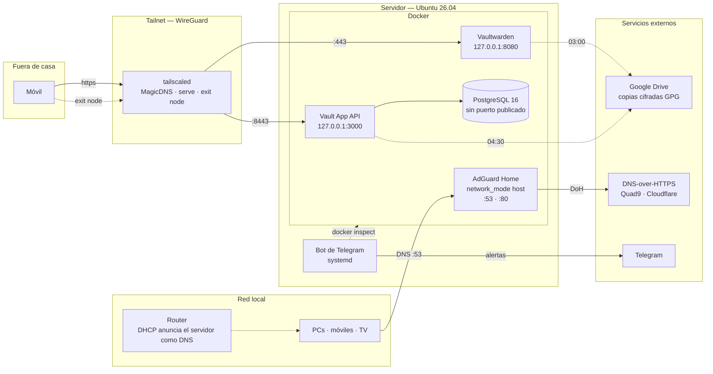

# Servidor Linux autoalojado

Un servidor en casa que hace de **DNS con filtrado para toda la
red**, **gestor de contraseñas familiar** y **entorno de despliegue** de mis
propios proyectos. Sin puertos abiertos en el router, con TLS real y con
copias cifradas que salen solas cada noche.

Este repositorio es la configuración de esa máquina: los `docker-compose`
de cada servicio, la unidad de systemd del bot de monitorización, los
scripts de copias y la documentación de cómo está montado y por qué.

> **Nota.** No hay demo pública, y es intencionado: el diseño consiste
> precisamente en que nada de esto sea alcanzable desde internet. Lo que
> hay que mirar es la configuración y las decisiones.

---

## Por qué

Empezó por querer un gestor de contraseñas que no fuera una suscripción y
cuya bóveda no viviera en el servidor de otro. Al montarlo aparecieron los
problemas de verdad: cómo llegar desde fuera sin abrir el router, cómo
tener HTTPS con un certificado válido en una red doméstica, y qué pasa con
los datos cuando el disco falle.

Cada uno de esos problemas está resuelto aquí, y cada solución está
justificada en [`docs/decisiones.md`](docs/decisiones.md). El montaje
también es donde despliego mis propios proyectos, así que hace de entorno
de producción pequeño pero real: con copias, con monitorización y con la
obligación de que siga funcionando cuando no estoy delante.

---

## Arquitectura



Detalle, flujos y redes de Docker en
[`docs/arquitectura.md`](docs/arquitectura.md).

---

## Servicios

| Servicio | Qué resuelve | Acceso |
|---|---|---|
| **AdGuard Home** | DNS con filtrado de publicidad y telemetría para toda la casa, en el router y no en cada dispositivo | `:53` en la LAN · web en `:80` |
| **Vaultwarden** | Gestor de contraseñas familiar, compatible con los clientes de Bitwarden, sin cuota y sin bóveda en servidor ajeno | `https://<host>.<tailnet>.ts.net` |
| **Vault App** | API propia de finanzas personales (Fastify + PostgreSQL) | `https://<host>.<tailnet>.ts.net:8443` |
| **Bot de Telegram** | Toda la observabilidad: alertas de CPU, RAM, disco, temperatura y servicios caídos | Telegram |
| **Tailscale** | Red privada, terminación TLS y nodo de salida | — |
| **Cockpit** | Panel de administración del host | `:9090` |

Ficha de cada uno en [`docs/servicios.md`](docs/servicios.md).

---

## Decisiones

Las cuatro que más forma le dan al montaje. Las ocho, con alternativas
descartadas, en [`docs/decisiones.md`](docs/decisiones.md).

**Tailscale en lugar de abrir puertos.** Abrir el 443 de casa significa
aceptar que todo internet llame a la puerta y confiar en que cada servicio
detrás aguante. Con Tailscale la superficie de ataque es el tailnet: un
servicio con un fallo sin parchear sigue siendo inalcanzable para quien no
esté dentro. De regalo, tres cosas que si no habría que montar aparte: DNS
estable, certificados y acceso sin IP fija.

**El DNS del host apunta a 1.1.1.1, no a AdGuard.** Parece incoherente y
es deliberado. Si el servidor se resolviera a través de AdGuard habría una
dependencia circular: Docker necesita resolver el registro para arrancar
AdGuard, y necesita AdGuard para resolver. Bastaría con que el contenedor
no levantara tras un reinicio para dejar la máquina sin DNS y sin forma de
arreglarlo desde dentro.

**TLS lo gestiona tailscaled, no un proxy inverso.** `tailscale serve`
termina TLS con un certificado real de Let's Encrypt y lo renueva solo. Un
Nginx delante añadiría un contenedor, su configuración, su renovación y un
punto de fallo, para el mismo resultado.

**Todo escucha en `127.0.0.1`, nunca en `0.0.0.0`.** `tailscale serve`
corre en el host y alcanza los servicios por loopback, así que publicar en
todas las interfaces no aporta nada y abre el servicio a la red local en
claro. Estar dentro de casa no es una credencial: la wifi de invitados y
la TV con firmware de 2019 están en esa misma red.

---

## Problemas que me he comido

Los ocho, con síntoma, causa y solución, en
[`docs/incidencias.md`](docs/incidencias.md). Los que más enseñaron:

**El puerto 80 ya estaba ocupado y `docker ps` no lo decía.** AdGuard corre
en `network_mode: host`: ocupa el 80 de la máquina entera sin publicar
ningún puerto, así que no aparece en `docker ps`. Solución: ningún
servicio usa el 80; todos escuchan en puertos altos en loopback y
`tailscale serve` los publica con TLS.

**Las passkeys murieron al pasar de IP a dominio.** WebAuthn ata cada
credencial a un RP ID derivado del origen donde se registró. Las passkeys
creadas bajo `http://192.168.1.X:8080` no son válidas bajo
`https://<host>.<tailnet>.ts.net`, y no hay migración: son
criptográficamente ajenas. Hubo que volver a registrarlas. La lección es
que la URL definitiva se decide **antes** de registrar nada.

**Tras un corte de luz no volvía ni el monitor.** Faltaban políticas de
reinicio, y el bot arrancaba antes que Docker y tailscaled. Ahora lleva
`After=` —no `Requires=`— sobre ambos, con `Restart=always`: si Docker
falla, el bot arranca igual y **avisa**, en lugar de morir junto a lo que
vigila.

**AdGuard llevaba meses guardando su configuración en
`/path/to/your/conf`.** Se copió el compose de un ejemplo sin editar las
rutas de los volúmenes, y Docker creó ese directorio literalmente en la
raíz. Todo funcionaba. Un respaldo de la carpeta "correcta" habría copiado
un directorio vacío.

**La bóveda estaba accesible en HTTP plano desde toda la LAN.** El mapeo
`"8080:80"` publica en `0.0.0.0`. Comprobado desde otra máquina de la red:
`http://192.168.1.X:8080/` devolvía 200. El túnel de Tailscale no cierra
por sí solo el camino viejo — hay que cerrarlo y verificarlo.

**El script de copias podía borrarme las copias buenas.** Sin `set -e`, un
volcado fallido seguía adelante, empaquetaba un directorio vacío, subía
ese tar de 109 bytes y luego ejecutaba la rotación de 7 días. Siete noches
fallando en silencio y no queda nada. Ahora verifica el volcado con
`PRAGMA integrity_check`, comprueba el tamaño y rota **solo** tras una
subida correcta.

---

## Pendiente

La deuda que conozco. Está aquí porque reconocerla vale más que ocultarla.

**Infraestructura**

- [ ] **SAI.** Ahora mismo un corte de luz es un apagón sucio para un
      Postgres y un SQLite en marcha. Los servicios vuelven solos, pero la
      integridad depende de la suerte y del journal. Es la carencia más
      seria del montaje.
- [ ] **Claves SSH en lugar de un PAT.** El acceso a GitHub va por HTTPS
      con token personal: caduca, hay que rotarlo a mano y vive en el
      disco.
- [ ] **Cockpit a loopback.** Es el único servicio que escucha en
      `0.0.0.0`. Debería publicarse por `tailscale serve` como los demás.
- [ ] **Mover los datos de AdGuard** de `/path/to/your/` a rutas relativas
      al compose. El repo ya lleva la versión corregida; aplicarlo en la
      máquina implica parar el DNS de la casa un momento.

**Copias**

- [ ] **Probar la restauración automáticamente.** Hoy se hace a mano. Un
      script mensual que levante un contenedor desechable, verifique y
      avise por el bot cerraría el círculo.
- [ ] **Una tercera copia fuera de Google.** Todo depende de una cuenta.
      Un disco externo que se conecte de vez en cuando es la única defensa
      real contra perder esa cuenta.

**Bot**

- [ ] Registrar un `error_handler`: los 502 de Telegram vuelcan una traza
      completa aunque la librería reintente sola.
- [ ] Capturar `BadRequest: Message is not modified` al pulsar dos veces
      el mismo botón.
- [ ] Persistir los cooldowns: al reiniciar el servicio se olvidan.

---

## Estructura

```
homelab/
├── docs/
│   ├── arquitectura.md    Hardware, plano, flujos, redes de Docker
│   ├── servicios.md       Ficha de cada servicio
│   ├── decisiones.md      Por qué así y no de otra forma
│   ├── incidencias.md     Lo que se rompió y cómo se arregló
│   ├── operaciones.md     Runbook: cómo hacer cada cosa
│   └── backups.md         Estrategia, restauración y cómo probarla
├── services/
│   ├── adguardhome/       compose + extracto de configuración
│   ├── vaultwarden/       compose
│   └── vault-app/         compose + .env.example
├── bot/                   Código del bot de monitorización
├── systemd/               Unidad del bot
├── scripts/               Copias cifradas a Google Drive
└── tailscale/             serve, certificados y comprobaciones
```

---

## Sanitización

Este repositorio está limpio a propósito. No contiene el nombre real del
tailnet ni de la máquina, IPs del tailnet, correos, tokens, contraseñas ni
hashes, y por supuesto ningún dato de servicio: ni `vw-data`, ni volúmenes
de Postgres, ni copias.

Los marcadores que aparecen:

| Marcador | Qué es en realidad |
|---|---|
| `<host>.<tailnet>.ts.net` | El nombre MagicDNS de la máquina |
| `<IP_LAN>` | Su IP en la red local |
| `/home/homelab/` | El directorio del usuario de servicio |
| `<tu-correo>@example.com` | La cuenta de correo del SMTP |
| `<token-...>`, `<contraseña-...>` | Secretos, que viven en `.env` fuera de git |

El `.gitignore` bloquea `.env`, claves, certificados, `*.sqlite3`, `*.dump`
y los directorios de datos de cada servicio.

---

## Licencia

MIT. Ver [LICENSE](LICENSE).
