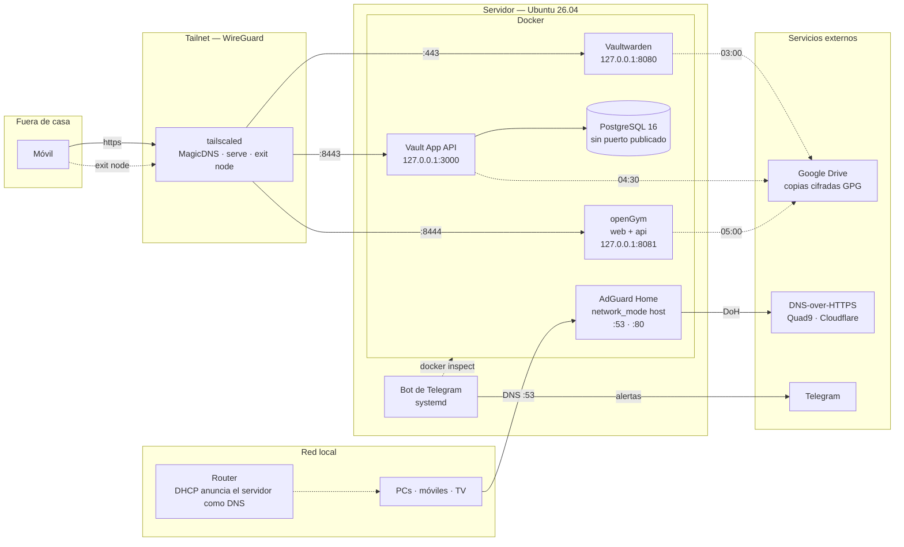
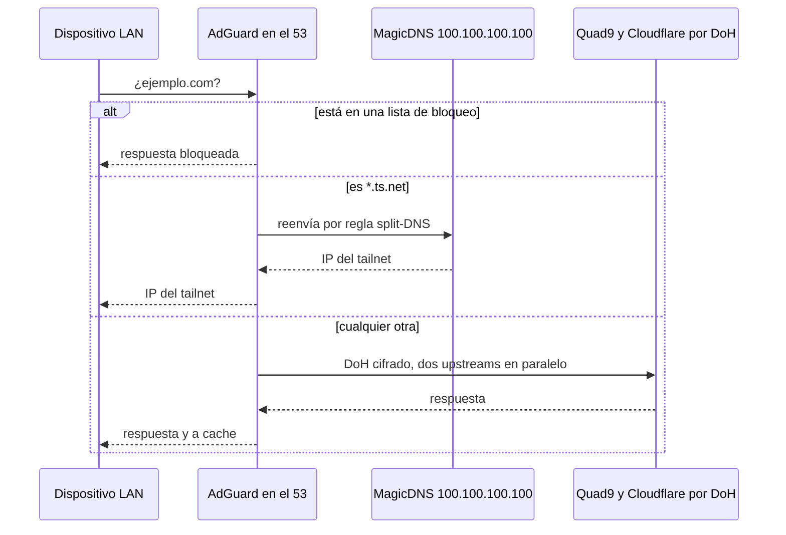

# Arquitectura

## Hardware

Un mini PC de sobremesa reutilizado. No es un NAS ni un rack: es el
ordenador que había, con el consumo de una bombilla.

| | |
|---|---|
| Equipo | Lenovo ThinkCentre M715q |
| CPU | AMD Ryzen 5 PRO 2400GE |
| RAM | 16 GB |
| Disco | NVMe 256 GB |
| SO | Ubuntu 26.04 LTS |
| Red | Ethernet a 1 Gb, IP fija por reserva DHCP en el router |

Dimensionar esto de más es el error clásico del homelab. Con seis
contenedores, un bot y Postgres, el consumo en reposo es de ~2 GiB de RAM
y prácticamente nada de CPU. El cuello de botella no es la máquina.

## Plano general

## Los tres caminos de entrada

Solo el primero atraviesa la frontera de casa.

**1. Desde fuera — Tailscale.** El móvil se conecta al tailnet y llega a
`https://<host>.<tailnet>.ts.net`. TLS real, sin puertos abiertos en el
router, sin DNS dinámico, sin túnel de terceros. Si el dispositivo no
está en el tailnet, el servidor no existe para él.

**2. Desde la red local — DNS.** El router reparte por DHCP la IP del
servidor como DNS. Todos los dispositivos de casa resuelven contra
AdGuard sin configurar nada en cada uno.

**3. Desde el propio host — loopback.** Vaultwarden, la API de Vault,
openGym y Armario publican sus puertos **solo** en `127.0.0.1`. Quien los saca al
tailnet es `tailscale serve`, que corre en el host y por tanto los ve por
loopback. Ningún servicio de aplicación es alcanzable directamente desde
la LAN.

Con openGym hubo que corregir el compose del proyecto, que trae
`"${WEB_PORT:-8080}:80"`: publicado tal cual, habría repetido la incidencia
de Vaultwarden —servicio en HTTP plano visible desde toda la red local— y
además habría chocado con el 8080 que ya ocupa la bóveda.

## Flujo de una consulta DNS

La regla `[/ts.net/]100.100.100.100` es la que hace que los nombres
MagicDNS funcionen también para los clientes que usan AdGuard como DNS.
Sin ella, un dispositivo de la LAN resuelve todo internet pero no
encuentra el propio servidor por su nombre de tailnet.

## Redes de Docker

| Red | Quién | Por qué |
|---|---|---|
| `host` | AdGuard Home | Necesita ver la IP de origen real de cada consulta; a través del bridge todas llegarían con la IP de la pasarela y las estadísticas por cliente dejarían de existir |
| bridge propio | Vaultwarden | Aislado, con el puerto publicado solo en loopback |
| bridge propio | Vault App (api + postgres) | Postgres **no publica ningún puerto**: solo la API lo alcanza, por el nombre de servicio dentro de la red del compose |
| bridge propio | openGym (web + api) | La API **no publica ningún puerto**: solo la alcanza nginx, que proxea `/api` por el nombre de servicio. Un único origen, que es lo que exige WebAuthn |
| la red de Vault App | Armario (solo la API) | Se une a una red que ya existe, en vez de crear la suya, porque **reutiliza el Postgres que ya está ahí** con base y rol propios. Levantar un segundo Postgres duplicaría memoria en una máquina modesta y duplicaría la ruta de copias |

Que Postgres no exponga puerto no es un detalle: es la razón por la que
la base de datos no necesita defenderse de nada. Su única superficie son
las APIs que lo usan. Lo mismo vale para la API de openGym, que guarda las claves
públicas de las passkeys y el secreto de sesión: su única superficie es el
nginx que tiene delante.

Que dos servicios compartan instancia de Postgres tiene una contrapartida
que conviene tener presente: **un apagón sucio o una migración que salga
mal afectan a los dos**. Se acepta porque el rol de cada uno solo alcanza
su propia base, las copias se lanzan por separado y a horas distintas, y
duplicar el motor en esta máquina costaría más de lo que aísla.
